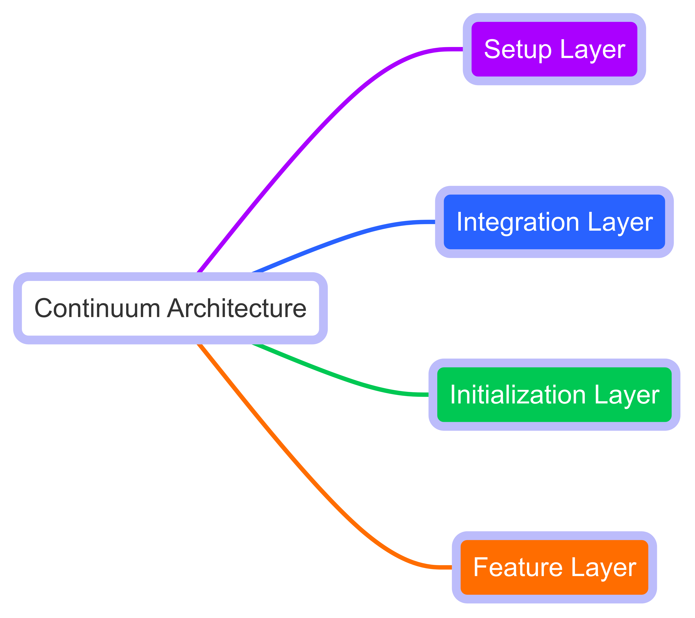
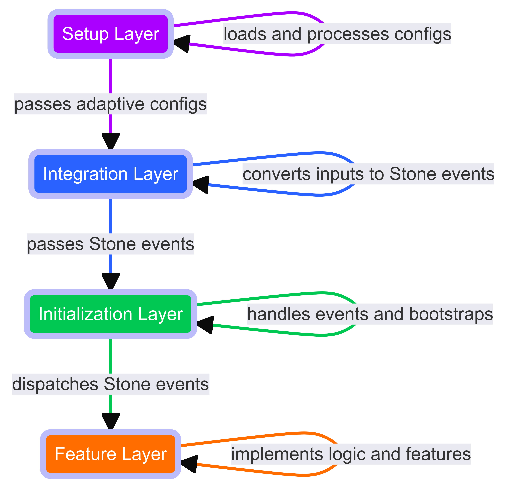

# Continuum Architecture

**The Continuum Architecture** is an innovative architectural approach designed to create scalable, flexible, and cost-effective web applications that run seamlessly across various platforms. By leveraging a modular, adaptive configuration and an event-driven structure, Continuum Architecture ensures that your applications are powerful, efficient, and easy to maintain and extend. This documentation will guide you through understanding and implementing Continuum Architecture.

## Vision and Mission

### Vision

Enable applications to run anywhere, on any platform, without compromising on functionality or configuration.

### Mission

Provide a modular, flexible architecture that supports scalable development, from nano to macro applications, with zero or flexible configuration.

## Architecture Overview

Continuum Architecture is composed of four primary layers:

Each layer has distinct responsibilities, ensuring a clear separation of concerns and ease of maintenance.

### Layer Descriptions

#### 1. Setup Layer

- **Purpose**: Automatically load and configure the initial setup using a series of processes.
- **Components**: Configuration Builder, Pipeline, Pipes.
- **Function**: Prepares the environment by gathering and processing configuration data needed for the application.

#### 2. Integration Layer

- **Purpose**: Bridge the platform and the application, converting inputs into understandable events (Stone Events).
- **Components**: Adapters, Mappers, Middleware, Hooks, Handler Factory.
- **Function**: Ensures smooth communication and data transformation between the platform and the application.

#### 3. Initialization Layer

- **Purpose**: Set up the application environment, register services, and process events.
- **Components**: Service Container, Event Emitter, Error Handler, Middleware, Hooks, Application Handler.
- **Function**: Initializes services and handles events before passing them to the Feature layer.

#### 4. Feature Layer

- **Purpose**: Implement user-defined functionalities and consume application services.
- **Components**: User Application Logic, Services, Event Listeners, Router.
- **Function**: The main application layer where business logic and features are implemented.

## Interactions and Data Flow

Each layer in the Continuum Architecture interacts seamlessly to ensure a smooth data flow and efficient processing. 
The Initial Setup Layer loads and processes configurations, passing the processed data to the Integration Layer. 
The Integration Layer then converts platform-specific inputs into Stone events, which are handled by the Initialization Layer. 
Finally, the Feature Layer implements the business logic and features, utilizing services and handling events.

## Key Features

- **Modularity**: Clear separation of concerns through distinct layers.
- **Flexibility**: Adapts to various platforms without modifying core functionality.
- **Scalability**: Supports both small-scale and large-scale applications.
- **Configuration Automation**: Automatic configuration loading and processing using a setup pipeline.
- **Event-Driven**: Utilizes an event-driven approach for better responsiveness and modularity.

## Advantages

- **Flexibility and Extensibility**: Easily adapts to different environments and can be extended with new functionalities.
- **Modular Design**: Simplifies development and maintenance by separating concerns.
- **Automatic Configuration**: Reduces initial setup complexity and accelerates development.

## Disadvantages

- **Complexity**: The multi-layered approach can introduce complexity, particularly for smaller projects.
- **Performance Overhead**: The extensive use of middleware and event handling can impact performance.

## Best Practices and Guidelines

### Design Patterns

Adopt well-known design patterns such as Singleton, Factory, and Observer to ensure code maintainability and readability. Utilize the event-driven nature of the architecture to create decoupled and reusable components.

### Implementation Tips

- **Separation of Concerns**: Keep different functionalities within their respective layers to maintain clarity and modularity.
- **Configuration Management**: Utilize the Configuration Builder to manage and validate configurations efficiently.
- **Event Handling**: Leverage the event-driven architecture to create responsive and interactive applications.

## Use Cases and Examples

### Example Scenarios

- **Microservices**: Implementing small, independent services that communicate through events.
- **Enterprise Applications**: Building large-scale applications with complex business logic and extensive service requirements.

### Real-World Applications

- **E-commerce Platforms**: Managing a wide range of functionalities from inventory to customer service.
- **Healthcare Systems**: Handling sensitive data and integrating with various healthcare services.

## Collaborative Development

### How to Contribute

Developers can contribute to the Continuum Architecture by submitting issues, proposing changes, and participating in discussions. Contributions are welcomed through pull requests and the Request for Comments (RFC) process.

### RFC Process

1. **Submit RFC**: Propose a new feature or change through an RFC document.
2. **Community Review**: Engage with the community to discuss and refine the proposal.
3. **Refinement**: Incorporate feedback and improve the proposal.
4. **Approval**: Achieve consensus and approval from maintainers.
5. **Implementation**: Develop and integrate the approved feature or change.

## Conclusion

Continuum Architecture provides a robust, flexible, and scalable solution for modern web application development. By following the principles outlined in this documentation, developers can build applications that are powerful, efficient, and adaptable to a wide range of environments.

---

## Call to Action

We invite you to join us in building the future of web application architecture. Contribute to the Continuum Architecture, participate in discussions, and help us create a universal standard for scalable, flexible, and cost-effective applications.

To understand our guiding principles and vision, please read the [Manifesto](MANIFESTO.md). 
For proposing new ideas or changes, refer to our [RFC](rfcs/) process. Together, we can achieve great things.